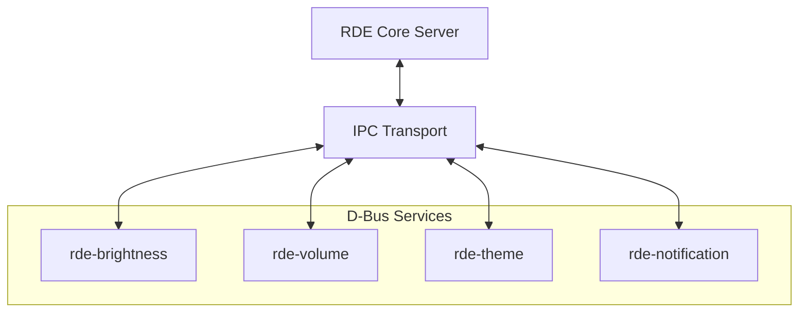

# RDE: Riju Desktop Environment

[](https://www.rust-lang.org/)
[](https://opensource.org/licenses/MIT)
[](https://www.linux.org/)

**RDE** (Riju Desktop Environment) is a modular, high-performance, and modern suite of system services designed for the Linux desktop. Built from the ground up in Rust, RDE focuses on efficiency, safety, and seamless inter-process communication.

---

## 🏗 Architecture

RDE follows a **microservices-based architecture**. Each system component (Brightness, Volume, Theme, etc.) runs as an independent service, communicating over the system D-Bus and a dedicated IPC infrastructure.



### Core Components

| Component | Description | Tech Stack |
| :--- | :--- | :--- |
| **`rde` (Root)** | Central IPC infrastructure and server management. | Unix Domain Sockets |
| **`rde-core`** | Shared utilities, filesystem abstraction, and storage logic. | `tokio`, `dirs` |
| **`rde-brightness`** | Screen backlight control with percentage-based logic. | Sysfs, `pkexec` |
| **`rde-volume`** | Audio management with real-time signal feedback. | ALSA, `zbus` |
| **`rde-theme`** | Persistent theme management and mode switching. | JSON Storage, `serde` |
| **`rde-notification`** | (WIP) Lightweight desktop notification daemon. | D-Bus |

---

## 🚀 Key Features

- **⚡ Blazing Fast**: Leverages Rust's zero-cost abstractions and the `tokio` asynchronous runtime.
- **🔗 Modular Design**: Services are decoupled; if one fails, the rest of the environment remains stable.
- **📱 Standard Compliant**: Implements D-Bus interfaces for broad compatibility with existing desktop tools.
- **🛡 Safe & Secure**: Minimal memory footprint and strict ownership model to prevent common system-level bugs.
- **📂 Persistent State**: Integrated storage management for user preferences and configurations.

---

## 🚦 Getting Started

### Prerequisites

- **Rust Toolchain**: `rustc` and `cargo` (Edition 2024 recommended).
- **D-Bus**: Standard system/session bus.
- **ALSA Libs**: Required for `rde-volume` (`libasound2-dev` on Debian/Ubuntu).
- **Polkit**: For `rde-brightness` privileged writes.

### Installation

1. **Clone the repository:**
   ```bash
   git clone https://github.com/your-username/rde.git
   cd rde
   ```

2. **Build the entire workspace:**
   ```bash
   cargo build --release
   ```

### Running the Services

You can run each service individually or start the core server:

```bash
# Start the core IPC server
cargo run --bin rde

# Start specific services
cargo run --bin rde-brightness
cargo run --bin rde-volume
cargo run --bin rde-theme
```

---

## 📡 D-Bus API Reference

RDE exposes several interfaces on the D-Bus session/system bus for external consumption (e.g., by status bars, control panels, or keyboard shortcuts).

### Example: Volume Control
- **Bus Name**: `org.rde.Volume`
- **Interface**: `org.rde.Volume`
- **Methods**: `increase_volume`, `decrease_volume`, `set_volume`
- **Signals**: `VolumeChanged`

---

## 🛠 Development

### Project Structure
- `core/`: Shared library containing core logic and FS abstractions.
- `services/`: Directory containing all modular system services.
- `src/`: Root crate containing the IPC server and transport layer.

### Running Tests
```bash
cargo test --workspace
```

---

## 📄 License

This project is licensed under the **MIT License**. See the [LICENSE](LICENSE) file for details.

---

<p align="center">
  Built with ❤️ by <a href="https://github.com/rijum8906">Riju Mondal</a>
</p>
