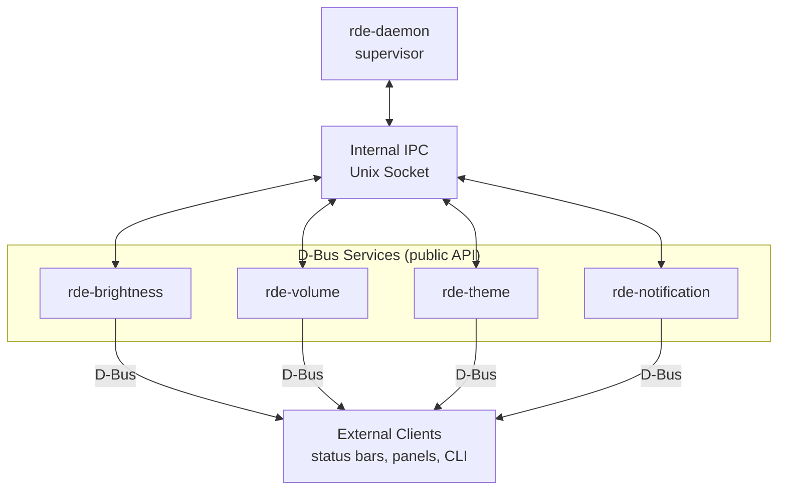

# RDE: Riju Desktop Environment

**RDE** (Riju Desktop Environment) is a modular, high-performance suite of system services for the Linux desktop, built from the ground up in Rust. RDE favors small, independent services over a monolithic daemon, and speaks standard D-Bus so it works with existing desktop tooling out of the box.

<!--toc:start-->
- [RDE: Riju Desktop Environment](<README#RDE: Riju Desktop Environment>)
  - [🏗 Architecture](#🏗-architecture)
    - [Core Components](#core-components)
  - [🚀 Key Features](#🚀-key-features)
  - [🚦 Installation](#🚦-installation)
    - [From package manager](#from-package-manager)
    - [Building from source](#building-from-source)
  - [Run the Services](#running-the-services)
  - [📡 D-Bus API Reference](#📡-d-bus-api-reference)
  - [📁 Project Structure](#📁-project-structure)
  - [🛠 Development](#🛠-development)
  - [🤝 Contributing](#🤝-contributing)
  - [📄 License](#📄-license)
<!--toc:end-->

[](https://www.rust-lang.org/)
[](LICENSE)
[](https://www.linux.org/)
[](.github/workflows/ci.yml)

---

---

## 🏗 Architecture

RDE separates **two concerns** that are often conflated in desktop daemons:

- **D-Bus** — the public, standard-compliant interface external tools (status bars, control panels, keyboard shortcuts) use to talk to services.
- **Internal IPC** (Unix domain sockets) — a private channel between `rde-daemon` and each service, used only for supervision: registration, health checks, and restarts.



`rde-daemon` does not proxy service functionality itself — it only starts, monitors, and restarts services. Each service owns its own D-Bus interface directly. See [`docs/architecture.md`](docs/architecture.md) for the full design rationale.

### Core Components

| Component | Type | Description | Tech Stack |
| :--- | :--- | :--- | :--- |
| **`rde-daemon`** | Service | Central supervisor: starts, monitors, and restarts services. | `tokio` |
| **`rde-core`** | Crate | Shared utilities, filesystem abstraction, error types. | `tokio`, `dirs` |
| **`rde-config`** | Crate | Config parsing and XDG path resolution. | `serde`, `toml` |
| **`rde-ipc`** | Crate | Internal message payloads and Unix socket transport. | `tokio`, `serde` |
| **`rde-cli`** | Binary | Lightweight CLI for sending commands to the daemon/services. | `clap` |
| **`rde-brightness`** | Service | Screen backlight control with percentage-based logic. | Sysfs, `pkexec` |
| **`rde-volume`** | Service | Audio management with real-time signal feedback. | ALSA, `zbus` |
| **`rde-theme`** | Service | Persistent theme management and mode switching. | JSON Storage, `serde` |
| **`rde-notification`** | Service | *(WIP)* Lightweight desktop notification daemon. | D-Bus |

---

## 🚀 Key Features

- **⚡ Blazing Fast** — leverages Rust's zero-cost abstractions and the `tokio` async runtime.
- **🔗 Modular Design** — services are decoupled; if one crashes, the rest of the environment stays stable.
- **📱 Standard Compliant** — implements D-Bus interfaces for broad compatibility with existing desktop tools.
- **🛡 Safe & Secure** — minimal memory footprint and a strict ownership model to prevent common system-level bugs.
- **📂 Persistent State** — shared storage abstraction for user preferences and configuration.
- **📦 Native Packaging** — first-class `.deb`, `.rpm`, and Arch (`PKGBUILD`) packages, not just `cargo install`.

---

## 🚦 Installation

### From package manager

<details>
<summary><strong>Debian / Ubuntu (apt)</strong></summary>

```bash
sudo apt install ./rde_<version>_amd64.deb
```

Or add the RDE APT repository (see [`docs/packaging.md`](docs/packaging.md) for setup).
</details>

<details>
<summary><strong>Fedora / RHEL / openSUSE (dnf / zypper)</strong></summary>

```bash
sudo dnf install rde-<version>.x86_64.rpm
```
</details>

<details>
<summary><strong>Arch Linux / Manjaro (pacman / AUR)</strong></summary>

```bash
yay -S rde
# or manually:
git clone https://aur.archlinux.org/rde.git
cd rde && makepkg -si
```
</details>

### Building from source

**Prerequisites:**
- Rust toolchain (`rustc` + `cargo`, edition 2024 recommended)
- D-Bus (standard system/session bus)
- ALSA development libraries (`libasound2-dev` on Debian/Ubuntu) — required for `rde-volume`
- Polkit — required for `rde-brightness` privileged writes

```bash
git clone https://github.com/rijum8906/rde.git
cd rde
cargo build --release
```

---

## Running the Services

```bash
# Start the supervisor (recommended — manages all services)
cargo run --bin rde-daemon

# Or run a service individually, for development/debugging
cargo run --bin rde-brightness
cargo run --bin rde-volume
cargo run --bin rde-theme

# Send a command via the CLI
rde-cli volume set 65
```

For persistent background operation, install the provided systemd user units from [`assets/systemd/`](assets/systemd/):

```bash
systemctl --user enable --now rde-daemon.service
```

---

## 📡 D-Bus API Reference

Every service exposes its own interface directly on the session bus. Full method/signal/property tables live in [`docs/dbus-api.md`](docs/dbus-api.md); summary below.

| Service | Bus Name | Interface | Key Methods | Signals |
| :--- | :--- | :--- | :--- | :--- |
| Volume | `org.rde.Volume` | `org.rde.Volume` | `IncreaseVolume`, `DecreaseVolume`, `SetVolume` | `VolumeChanged` |
| Brightness | `org.rde.Brightness` | `org.rde.Brightness` | `SetBrightness`, `GetBrightness` | `BrightnessChanged` |
| Theme | `org.rde.Theme` | `org.rde.Theme` | `SetTheme`, `SetMode` | `ThemeChanged` |
| Notification | `org.rde.Notification` | `org.freedesktop.Notifications` | `Notify`, `CloseNotification` | `NotificationClosed` |

The internal daemon↔service protocol (not for external use) is documented in [`docs/ipc-protocol.md`](docs/ipc-protocol.md).

---

## 📁 Project Structure

```
rde/
├── .github/                   # CI/CD workflows, issue & PR templates
├── assets/                    # systemd units, polkit policies, default config
├── packaging/                 # debian/, rpm/, arch/ packaging metadata
├── docs/                      # architecture, IPC protocol, D-Bus API, packaging
├── cli/
│   └── rde-cli/                # CLI client binary
├── crates/                    # shared libraries (no standalone binaries)
│   ├── rde-config/
│   ├── rde-core/
│   └── rde-ipc/
├── services/                  # independent microservice binaries
│   ├── rde-daemon/
│   ├── rde-brightness/
│   ├── rde-notification/
│   ├── rde-theme/
│   └── rde-volume/
├── Cargo.toml                 # virtual workspace manifest
└── README.md
```

---

## 🛠 Development

```bash
# Format, lint, and test the whole workspace
cargo fmt --all
cargo clippy --workspace --all-targets -- -D warnings
cargo test --workspace
```

Adding a new service? Copy the shape of an existing one under `services/` (`main.rs` → `dbus_iface.rs` → `backend.rs`) and register it with `rde-daemon`. See [`docs/architecture.md`](docs/architecture.md#adding-a-new-service) for the full walkthrough.

---

## 🤝 Contributing

Contributions are welcome. Please read [`CONTRIBUTING.md`](CONTRIBUTING.md) for coding standards, commit conventions, and the PR process, and [`CODE_OF_CONDUCT.md`](CODE_OF_CONDUCT.md) before participating.

Found a security issue? Please follow [`SECURITY.md`](SECURITY.md) instead of opening a public issue.

---

## 📄 License

This project is licensed under the **MIT License**. See the [LICENSE](LICENSE) file for details.

---

<p align="center">
  Built with ❤️ by <a href="https://github.com/rijum8906">Riju Mondal</a>
</p>
