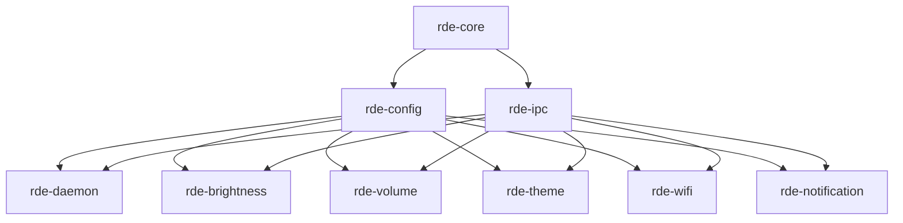

# Architecture

This document explains how RDE is structured internally and why, so contributors can extend it without breaking the design.

## Table of Contents

- [Design Goals](#design-goals)
- [Two Communication Layers](#two-communication-layers)
- [Component Responsibilities](#component-responsibilities)
- [Service Lifecycle](#service-lifecycle)
- [Crate Dependency Graph](#crate-dependency-graph)
- [Adding a New Service](#adding-a-new-service)

---

## Design Goals

1. **Isolation** — a crash in one service (e.g. `rde-volume`) must never take down the rest of the desktop environment.
2. **Standard compliance** — anything external (status bars, keyboard shortcut daemons, `polkit`) should be able to talk to RDE using plain D-Bus, without needing to know RDE-specific internals.
3. **Single source of truth per concern** — configuration, storage, and IPC framing are implemented once, in shared crates, and reused everywhere.
4. **Boring is good** — no dynamic plugin loading, no custom RPC framework beyond what's strictly needed. Prefer well-understood primitives (Unix sockets, D-Bus, JSON/TOML).

---

## Two Communication Layers

A common mistake in daemon design is letting the "internal" and "external" APIs merge into one. RDE deliberately keeps them separate:

| Layer | Transport | Audience | Purpose |
| :--- | :--- | :--- | :--- |
| **Public API** | D-Bus (session/system bus) | External tools: status bars, panels, shortcuts, `rde-cli` | The actual functionality — set volume, get brightness, switch theme |
| **Internal supervision** | Unix domain socket (`rde-ipc`) | `rde-daemon` ↔ each service | Registration, health checks, graceful restart, config-reload signals |

**Why not just use D-Bus for everything, including supervision?** Because supervision needs to work even if a service hasn't finished registering its D-Bus interface yet, and because health-check/restart traffic shouldn't be observable or forgeable by arbitrary D-Bus clients. Keeping it on a private, daemon-owned socket avoids that entirely.

**Why not build a custom RPC layer instead of D-Bus for the public API?** Because "Standard Compliant" is a stated goal — reusing D-Bus means existing desktop tooling (waybar, polybar, GNOME/KDE panels, `playerctld`-style tools) can talk to RDE with zero RDE-specific code.

---

## Component Responsibilities

```
rde-daemon        supervises services; owns no user-facing functionality itself
rde-core          fs abstractions, shared error types, generic utilities
rde-config        XDG path resolution + typed config parsing (serde/toml)
rde-ipc           internal message types + Unix socket transport (daemon <-> service only)
rde-cli           thin client that calls services' public D-Bus methods
rde-brightness    owns org.rde.Brightness; talks to sysfs directly
rde-volume        owns org.rde.Volume; talks to ALSA via zbus
rde-theme         owns org.rde.Theme; persists via rde-core's storage abstraction
rde-wifi          owns org.rde.wifi; talks to NetworkManager via system D-Bus
rde-notification  owns org.freedesktop.Notifications (WIP)
```

A service crate never talks to another service crate directly. If `rde-theme` needs to react to a brightness change (for example, auto dark-mode based on ambient light in the future), it subscribes to the relevant D-Bus signal — it does not import `rde-brightness`.

---

## Service Lifecycle

1. `rde-daemon` starts and reads its config via `rde-config`.
2. For each configured service, `rde-daemon` spawns the service process and opens a socket connection via `rde-ipc`.
3. The service sends a `Register` message over the internal socket, then claims its D-Bus bus name (e.g. `org.rde.Volume`, `org.rde.wifi`) and starts serving its public interface.
4. `rde-daemon` periodically sends `HealthCheck`; the service responds `Alive`. A missed response past a timeout threshold triggers a restart.
5. On `SIGTERM`/shutdown, `rde-daemon` sends `Shutdown` to each service over the internal socket, giving it a chance to persist state (via `rde-config`/`rde-core`) before the process exits.

See [`ipc-protocol.md`](ipc-protocol.md) for the exact message shapes used in this exchange.

---

## Crate Dependency Graph




No service crate depends on another service crate. Only `crates/*` are shared dependencies.

---

## Adding a New Service

1. Create `services/rde-<name>/` with the standard shape:
   ```
   services/rde-<name>/
   ├── Cargo.toml
   └── src/
       ├── main.rs        # entry point, daemon registration handshake
       ├── dbus/iface.rs  # public D-Bus interface implementation
       └── backend.rs     # the actual hardware/state logic or if needed create a `backend/`
   ```
2. Add it to the workspace `Cargo.toml` members list.
3. Depend on `rde-core`, `rde-config`, and `rde-ipc` as needed — never on another service crate.
4. Register the service in `rde-daemon`'s service list/config so it gets supervised.
5. Document its public D-Bus interface in [`dbus-api.md`](dbus-api.md).
6. Add a systemd user unit under `assets/systemd/` and, if it needs elevated access, a polkit policy under `assets/polkit/`.
7. Add integration coverage under the crate's own `tests/`.
