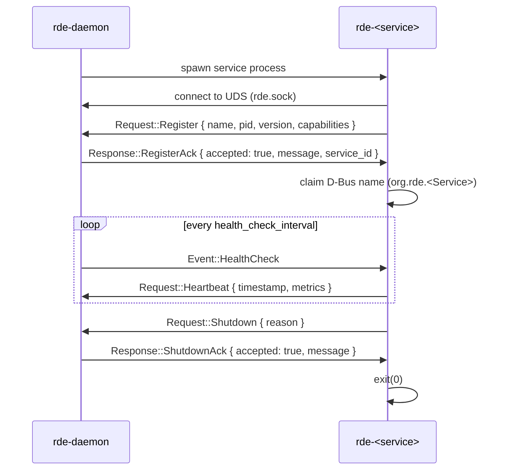

# Internal IPC Protocol

This document specifies the private protocol used between `rde-daemon` and each service over a Unix domain socket, implemented in the `rde-ipc` crate. This is not the public API — external tools should use D-Bus (see [`dbus-api.md`](dbus-api.md)).

## Table of Contents

- [Transport](#transport)
- [Framing](#framing)
- [Message Types](#message-types)
- [Handshake Sequence](#handshake-sequence)
- [Error Handling](#error-handling)
- [Versioning](#versioning)

---

## Transport

- **Socket path**: `$XDG_RUNTIME_DIR/rde/rde.sock` (falls back to `/run/user/<uid>/rde/rde.sock` if `XDG_RUNTIME_DIR` is unset).
- **Ownership**: created and bound by `rde-daemon` on startup, mode `0600` (owner read/write only).
- **Model**: one connection per service process, held open for the service's lifetime. `rde-daemon` is the listener; services are clients that connect on startup.

## Framing

Messages are length-prefixed, JSON-serialized frames sent over the Unix domain stream:

```
+----------------+------------------+
| u32 length (LE)| payload (JSON)   |
+----------------+------------------+
```

1. **Length**: A 4-byte unsigned integer in Little-Endian byte order representing the size of the serialized payload in bytes.
2. **Payload**: The JSON-serialized `Message` struct.

## Message Types

### Envelope Wrapper

Every message packet sent across the wire uses the top-level `Message` envelope:

```rust
pub struct Message {
    pub protocol_version: u32,
    pub message_id: u64,
    pub timestamp: u64,
    #[serde(flatten)]
    pub payload: MessagePayload,
}

pub enum MessagePayload {
    Request(Request),
    Response(Response),
    Event(Event),
}
```

### Requests (Client → Server)

Sent by a supervised service client to the daemon supervisor.

```rust
pub enum Request {
    /// Register a service with the daemon
    Register(RegisterRequest),
    /// Heartbeat sent in response to HealthCheck event
    Heartbeat(HeartbeatRequest),
    /// Request status of a specific service
    GetStatus(GetStatusRequest),
    /// Request status of all registered services
    ListServices(ListServicesRequest),
    /// Request the daemon to initiate clean shutdown
    Shutdown(ShutdownRequest),
    /// Send an unsolicited status update
    StatusUpdate(StatusUpdateRequest),
}
```

### Responses (Server → Client)

Sent by the daemon supervisor in response to a client Request.

```rust
pub enum Response {
    /// Generic successful response
    Success(SuccessResponse),
    /// Generic error response
    Error(ErrorResponse),
    /// Acknowledgment of a Register request
    RegisterAck(RegisterAckResponse),
    /// Acknowledgment / status of a GetStatus request
    Status(StatusResponse),
    /// Acknowledgment / list of services for a ListServices request
    ServiceList(ServiceListResponse),
    /// Acknowledgment of a Shutdown request
    ShutdownAck(ShutdownAckResponse),
}
```

### Events (Server → Client)

Unsolicited event notifications pushed by the daemon supervisor to connected clients.

```rust
pub enum Event {
    /// Broadcast that a new service registered
    ServiceRegistered(ServiceRegisteredEvent),
    /// Broadcast that a service disconnected/unregistered
    ServiceUnregistered(ServiceUnregisteredEvent),
    /// Broadcast that a service status transitioned
    ServiceStatusChanged(ServiceStatusChangedEvent),
    /// Broadcast that the supervisor daemon is shutting down
    ServerShutdown(ServerShutdownEvent),
    /// Broadcast that configuration has reloaded
    ConfigReloaded(ConfigReloadedEvent),
    /// Periodic health/liveness probe sent by the daemon
    HealthCheck,
}
```

## Handshake Sequence

The sequence diagram below shows a typical startup handshake and subsequent health check cycles:



If a service client fails to reply to `Event::HealthCheck` with a `Request::Heartbeat` within the required grace period, the daemon assumes the client is hung or dead, tears down the UDS connection, terminates the process, and initiates restart rules.

## Error Handling

Generic failures return a `Response::Error` variant encapsulating details on the failure code:

```rust
pub struct ErrorDetails {
    pub code: u32,
    pub message: String,
    pub details: Option<String>,
}
```

Malformed framing packets (e.g. invalid length prefixes or unparseable JSON envelopes) will trigger immediate termination of the socket connection, and the daemon will apply process restart guidelines.

## Versioning

The protocol enforces checking compatibility of the `protocol_version` field on each received envelope:
- Current `PROTOCOL_VERSION` is `1`.
- Connections are rejected if the message's `protocol_version` is less than `MIN_PROTOCOL_VERSION` (`1`).
