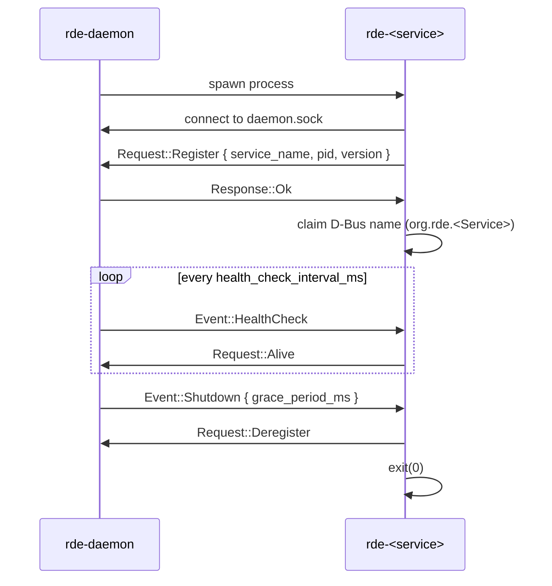

# Internal IPC Protocol

This document specifies the **private** protocol used between `rde-daemon` and each service over a Unix domain socket, implemented in the `rde-ipc` crate. This is not the public API — external tools should use D-Bus (see [`dbus-api.md`](dbus-api.md)).

## Table of Contents

- [Transport](#transport)
- [Framing](#framing)
- [Message Types](#message-types)
- [Handshake Sequence](#handshake-sequence)
- [Error Handling](#error-handling)
- [Versioning](#versioning)

---

## Transport

- **Socket path**: `$XDG_RUNTIME_DIR/rde/daemon.sock` (falls back to `/run/user/<uid>/rde/daemon.sock` if `XDG_RUNTIME_DIR` is unset).
- **Ownership**: created and bound by `rde-daemon` on startup, mode `0600`.
- **Model**: one connection per service process, held open for the service's lifetime. `rde-daemon` is the listener; services are clients that connect on startup.

## Framing

Messages are length-prefixed, serde-serialized (`bincode` or `serde_json`, TBD — see open question below) frames:

```
+----------------+------------------+
| u32 length (LE)| payload (N bytes)|
+----------------+------------------+
```

The payload deserializes to a `Message` enum (below). A 4-byte length prefix keeps framing simple over `tokio::net::UnixStream` without needing a separate codec crate for v1.

> **Open question:** `bincode` is smaller/faster; `serde_json` is easier to debug with `socat`/manual inspection during development. Current recommendation: `serde_json` until the protocol stabilizes, switch to `bincode` once the message set is frozen.

## Message Types

```rust
/// Top-level envelope sent in both directions.
#[derive(Serialize, Deserialize, Debug)]
pub enum Message {
    Request(Request),
    Response(Response),
    Event(Event),
}

/// Sent by a service to the daemon.
#[derive(Serialize, Deserialize, Debug)]
pub enum Request {
    /// First message a service sends after connecting.
    Register {
        service_name: String,   // e.g. "rde-volume"
        pid: u32,
        version: String,        // service's own crate version
    },
    /// Response to a daemon HealthCheck.
    Alive,
    /// Service is shutting down cleanly (e.g. after SIGTERM handled).
    Deregister { service_name: String },
}

/// Sent by the daemon to a service.
#[derive(Serialize, Deserialize, Debug)]
pub enum Event {
    /// Periodic liveness probe. Service must reply with Request::Alive
    /// within `health_check_timeout_ms` (config, default 2000ms).
    HealthCheck,
    /// Ask the service to reload its config from disk without restarting.
    ReloadConfig,
    /// Ask the service to persist state and exit gracefully.
    Shutdown { grace_period_ms: u64 },
}

/// Acknowledgement / result envelope for a Request.
#[derive(Serialize, Deserialize, Debug)]
pub enum Response {
    Ok,
    Error { code: ErrorCode, message: String },
}
```

## Handshake Sequence



If `Request::Alive` is not received within the timeout after `Event::HealthCheck`, `rde-daemon` logs a warning, kills the process if still present, and restarts it (subject to a backoff policy — see `rde-daemon`'s `registry.rs`).

## Error Handling

| `ErrorCode` | Meaning |
| :--- | :--- |
| `InvalidState` | Message received doesn't make sense for the current lifecycle state (e.g. `Register` sent twice). |
| `ConfigError` | `ReloadConfig` failed — service keeps running on its last-known-good config. |
| `Internal` | Unexpected internal failure; included message is for logs, not for display to end users. |

A malformed frame (bad length prefix, undeserializable payload) closes the connection; the daemon treats this identically to an unexpected disconnect and applies its restart policy.

## Versioning

The `Register` message includes the service's crate version, which the daemon logs but does not currently enforce — protocol compatibility is guaranteed by the workspace building all crates from the same `rde-ipc` version. If RDE ever ships services and daemon separately (e.g. via distro packages with independent update cadences), this section will need a real protocol version negotiation step; not required while the workspace is versioned/released as a unit.
